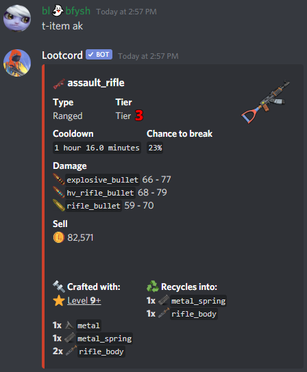
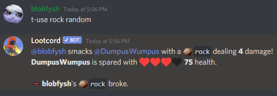
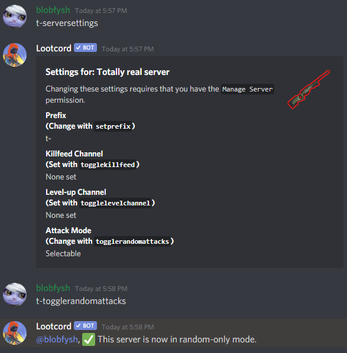
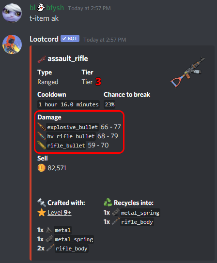

## Attacking Other Players

You can attack other players by using a weapon on them. This is done with the `use` command, ex. `t-use rock @blobfysh` would attack blobfysh with a [rock](/item/rock).

When you attack, you will receive an attack cooldown based on the weapon you used to attack, you can check how long the weapon's cooldown is with the `item` command, ex. `t-item rock` to see how long an attack cooldown would be when using a rock.

Note that guns have a chance of breaking, if they do break you will receive the items that weapon recycles into. You can see what a gun recycles into with the `item` command.

## Random Attacks

You can attack random players by specifying random instead of a player mention. ex. `t-use rock random` will attack a random active player with a rock.

If you manage the server, you can force all attacks to be random with the `togglerandomattacks` command, you can check all server settings available to you with the `serversettings` command.

## Ammunition

Weapons are categorized by their type, melee or ranged. Melee weapons don't use ammo will always break when used while ranged weapons require ammo and have a chance of breaking. You can check what ammo a weapon uses with the `item` command:

