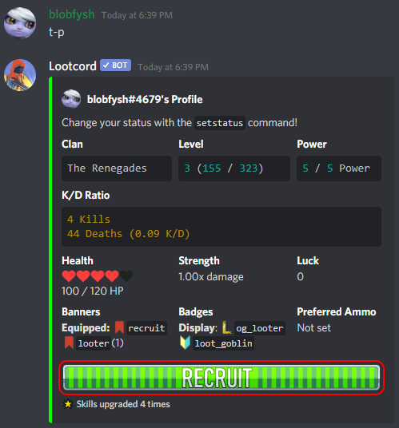
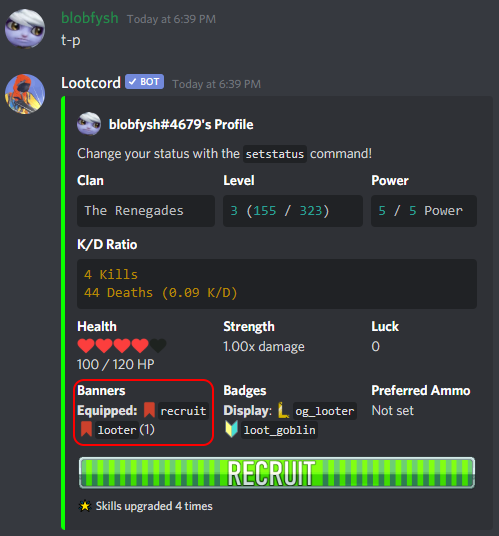
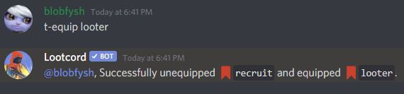
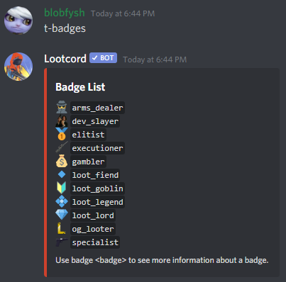
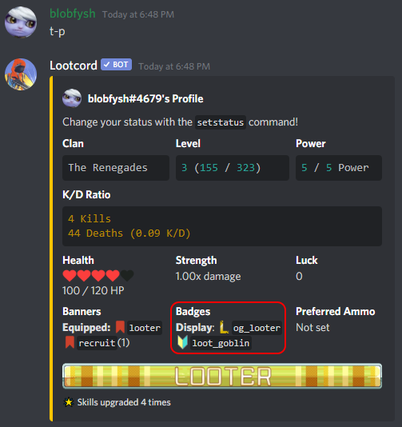
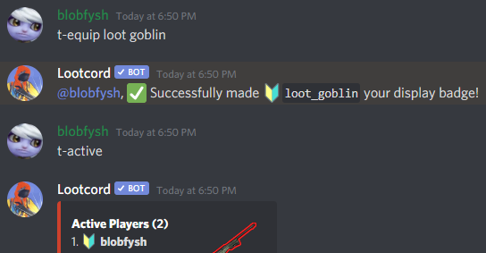

## What Is a Banner?

A banner is a cosmetic item that you can display on your `profile`:

You can view all banners you own and your currently equipped banner on your `profile`:

## How to Equip a New Banner

You can equip a banner using the `equip` command:

## What Is a Badge?

A badge is similar to a banner, they are cosmetics that you will display next to your name on some commands such as `t-clan info`, `t-leaderboard` and `t-active`. Badges are like achievements, you have to earn them by completing different tasks.

You can view all the different badges with the `badges` command:

## Equipping a Badge

Like banners, you can view what badges you own by checking your `profile`:

You can equip a badge using the `equip` command. You'll notice the badge start to be displayed in some commands such as `t-active`:

