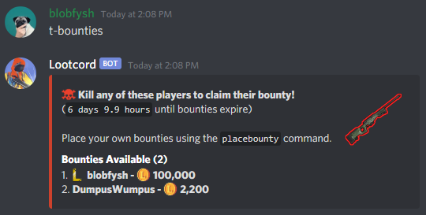

Using bounties, you can put money on someones head that can be claimed by whoever kills that player.

## How to Place a Bounty

You can place a bounty using the `placebounty` command:

## Viewing available bounties

You can view activated players in the server with bounties by using the `bounties` command:

Bounties expire every week on sunday. **If you placed a bounty that was not claimed by sunday you will receive your money back.**

### Some Notes About Bounties

- You can only place bounties on 3 players at a time.
- A player can have a max of a 1,000,000 Lootcoin bounty.
- You cannot place a bounty on members of your clan.