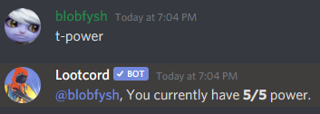
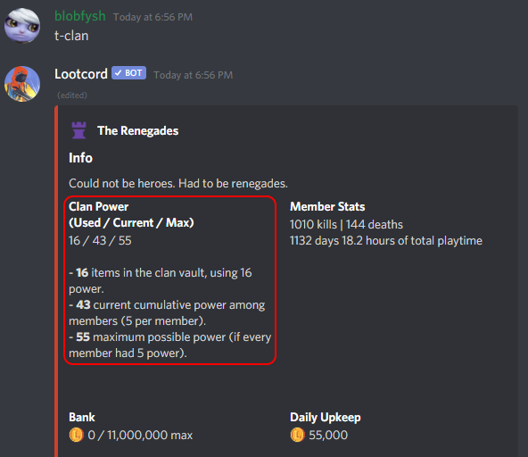

## What Are Clans?

Clans allow you to team up with other looters and combine your power. All clans have a vault that acts like a shared inventory for all the players in the clan.

- Clans have a maximum member limit of **20**.
- Clan members cannot attack each other.
- You can store money in the clan.
- Clans require a daily upkeep of 5,000 Lootcoin per member in the clan, this upkeep is automatically taken out of the clans bank each night. If you fail to pay the upkeep for the day, a random item will be removed from the clan vault.
- Each member can provide up to **5** power to the clan, increasing the combined [clan power](#clan-power) and allowing more items to be stored in the vault (1 power = 1 item slot in the vault).
- Only **Trusted**+ ranks provide power to a clan, this means you will have to promote Recruits in order for them to provide power to the clan. **Be careful though, Trusted members can withdraw items/money from the clan!**

## Clan Commands

### Rank Needed - None

- `t-clan help` - Shows all clan commands
- `t-clan create <clan name>` - Creates a new clan at the cost of 100,000 Lootcoin
- `t-clan info <clan name>` - Look up information about a clan such as members, money, power, and upkeep.
- `t-clan logs <clan name>` - Look up a clans logs or view your own clan logs. Show withdraws, deposits, raids, members joining/leaving.
- `t-clan vault <clan name>` - Similar syntax to the info command, but shows the items in a clans vault.
- `t-clan leave` - Leave your current clan.

### Rank Needed - Trusted+

- `t-clan raid <clan name>` - Raid another clan.
- `t-clan deposit <item/money> <amount>` - Deposit items/money into your clan.
- `t-clan withdraw <item/money> <amount>` - Withdraw items/money from your clan.

[[danger]]
| Be careful who you promote to trusted, they will be able to withdraw items/money from the clan and may rob you!

### Rank Needed - Officer+

- `t-clan invite <@user>` - Invite a user to your clan.
- `t-clan setstatus <status to set>` - Change the status of your clan.

### Rank Needed - Co-Leader+

- `t-clan promote <@user>` - Promotes a member in your clan to a higher rank.
- `t-clan demote <@user>` - Demotes a member in your clan to a lower rank.

### Rank Needed - Leader+

- `t-clan kick <@user/user ID>` - Kicks a member from the clan.

## The Clan Bank and Vault

Clans allow you to store your Lootcoin and items for safekeeping. The clan bank allows you to store up to 1,000,000 Lootcoin for each member in the clan. The clan vault allows you to store a number of items based on the clans [power](#clan-power).

## Clan Power

You might not have noticed it but every player in Lootcord has power, you can check how much power you currently have with `t-power`:

This power is contributed to your clan! If you have 5 power, your clan would be able to store 5 items.

### What's the Point of Power?

Your power can fluctuate. Every time you die you'll lose **2** power, down to a minimum of **-5**. This directly affects your clans power and makes the clan vulnerable to **raids**!

Your power will passively increase by **1** every 2 hours until you hit the maximum of 5 power.

## Clan Raiding

When a clan is **using** more power than they **currently** have, they can be raided with `t-clan raid`.

When you successfully raid another clan you will see a message telling you to pick an amount of items to steal from their vault. **The number of items you can steal is the amount of power they are using minus their current power.**

After the raid is finished, your clan will be put on a **1 hour** cooldown before being able to raid any other clans. The clan that was raided won't be able to get raided again for **24 hours**.