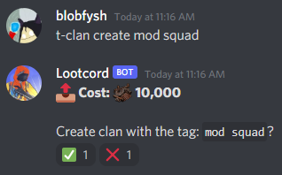
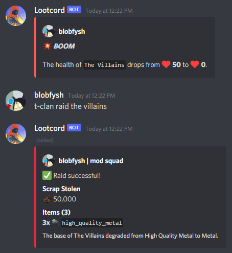

## What Are Clans?

With clans you can team up with up to **20** friends, store loot and scrap and raid other clans for their loot.

The main benefits to having a clan:

- Clanmates can't attack each other.
- You can store items and scrap in the clan, and they will be safe even if you die.
- You can use explosives to raid other clans for their loot.
- You get to have fun with friends :)

## Creating a Clan

You can create a clan using 10,000 scrap. Use the `t-clan create` command to create a clan with your desired name:

## Storing Items and Scrap

With the `t-clan deposit` command, you can deposit scrap or items to your clan storage. You can view the items the clan is holding with `t-clan storage` and you can view the scrap your clan is holding with `t-clan info`.

To remove items/scrap from the clan, simply use the `t-clan withdraw` command.

[[info]]
| `t-clan deposit/withdraw` can be used to deposit items or scrap. Ex. `t-clan deposit 1000` will deposit 1,000 scrap and `t-clan deposit rock 2` will deposit 2 rocks. `t-clan withdraw` works the same way.
|
| You can deposit as much scrap as you can with `t-clan deposit all`.

## Increasing the Amount of Items/Scrap Your Clan Can Store

The amount of items or scrap a clan can hold depends on the clans level. You can use the `clan upgrade` command to upgrade your clan to the next level:

#### Level: 1: Twig

This is the level your clan will start with.

- Storage can hold 3 items.
- Scrap bank can hold 50,000 scrap.
- Clan has 50 health.
- Daily upkeep costs 1,000 scrap.

#### Level 2: Wood

Upgrade costs **50,000 scrap and 2x wood**, upgrades the following:

- Storage can hold 5 items.
- Scrap bank can hold 150,000 scrap.
- Clan health increased to 75.
- Daily upkeep costs 5,000 scrap.

#### Level 3: Stone

Upgrade costs **150,000 scrap and 3x stone**, upgrades the following:

- Storage can hold 10 items.
- Scrap bank can hold 300,000 scrap.
- Clan health increased to 100.
- Daily upkeep costs 10,000 scrap.

#### Level 4: Metal

Upgrade costs **300,000 scrap and 4x metal**, upgrades the following:

- Storage can hold 20 items.
- Scrap bank can hold 1,000,000 scrap.
- Clan health increased to 200.
- Daily upkeep costs 20,000 scrap.

#### Level 5: High Quality Metal

Upgrade costs **1,000,000 scrap and 4x high\_quality\_metal**, upgrades the following:

- Storage can hold 40 items.
- Scrap bank can hold 2,000,000 scrap.
- Clan health increased to 300.
- Daily upkeep costs 50,000 scrap.

## Clan Ranks

Each member in your clan will have a rank, when you invite a new member to the clan, they will have the **Recruit** rank. You can promote members of the clan with the `t-clan promote <user>` command. The rank determines which commands they can use:

#### Rank Needed - None (these work without being in a clan)

- `t-clan help` - Shows all clan commands.
- `t-clan create <clan name>` - Creates a new clan at the cost of 10,000 scrap.
- `t-clan info <clan name>` - Look up information about a clan such as members, scrap, and upkeep.
- `t-clan logs <clan name>` - Look up a clans logs or view your own clan logs. Shows withdraws, deposits, raids, members joining/leaving.
- `t-clan storage <clan name>` - Shows the items in a clans storage.

#### Rank Needed - Recruit

- `t-clan leave` - Leave your current clan.

[[info]]
| Recruits can't do much besides appear on the member list, this is so you don't accidentally invite someone to the clan who robs you!

#### Rank Needed - Trusted+

- `t-clan raid <clan name>` - Raid another clan.
- `t-clan deposit <item/scrap> <amount>` - Deposit items/scrap into your clan.
- `t-clan withdraw <item/scrap> <amount>` - Withdraw items/scrap from your clan.

[[danger]]
| Be careful who you promote to trusted, they will be able to withdraw items/scrap from the clan and may rob you!

#### Rank Needed - Officer+

- `t-clan invite <@user>` - Invite a user to your clan.
- `t-clan setstatus <status to set>` - Change the status of your clan.

#### Rank Needed - Co-Leader+

- `t-clan promote <@user>` - Promotes a member in your clan to a higher rank.
- `t-clan demote <@user>` - Demotes a member in your clan to a lower rank.
- `t-clan upgrade` - Used to upgrade the clan

[[info]]
| The `promote`, `demote` and `kick` commands can be used with the number from the clan member list. This is useful if you're trying to demote or kick a user who is in your clan but doesn't share a server with you.

#### Rank Needed - Leader+

- `t-clan kick <@user>` - Kicks a member from the clan.

## Raiding Another Clan

Using explosives such as `c4`, you can lower the health of another clan. When a clan's health reaches **0**, they can be raided. To raid a clan that has 0 health, simply use `t-clan raid <name of clan>`. When you raid another clan, their base will degrade a level (unless they are already lowest level).

[[warning]]
| Make sure your clan has some open storage space and scrap bank space before you raid! When you raid a clan, you can steal as much items and scrap as your clan can hold. This means if a clan that had 40 open storage slots raided a clan that had 10 items, they would steal everything!

Heres an example of successful clan raid:

[[info]]
| The items stolen from raids are picked at random.