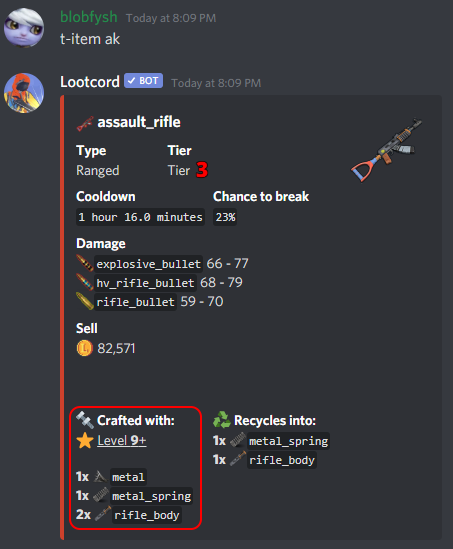
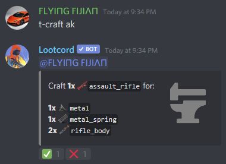
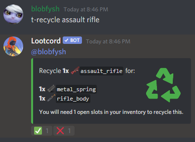
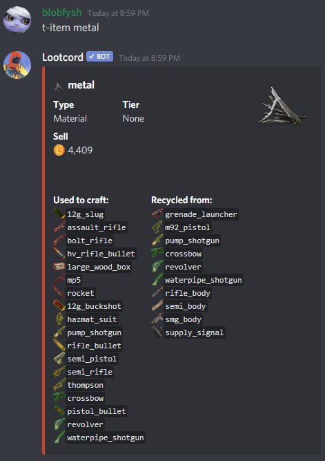

## How to Craft Items

Before you can craft an item, you should see what materials you'll need to craft it. You can check what an item is crafted with using the `item` command.

The assault\_rifle requires that you are at least level **9** and have 1x metal, 1x metal\_spring and 2x rifle\_body. Once you have these items in your inventory you can craft an assault\_rifle using the `craft` command.

## How to Recycle Items

Some items are able to be recycled for materials, you can check if an item can be recycled with the `item` command. If you want to recycle the item, just use the `recycle` command!

## Checking What Items a Resource Can Craft

You can see all items a materials can be used to craft with the `item` command, ex. `t-item metal` would show all items metal can craft:

You can also check what an item can be used to craft on the [items](/items) page.