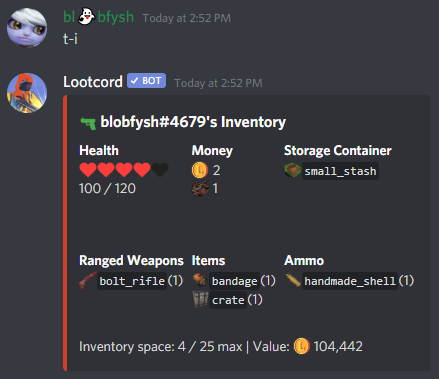
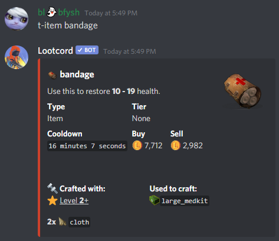
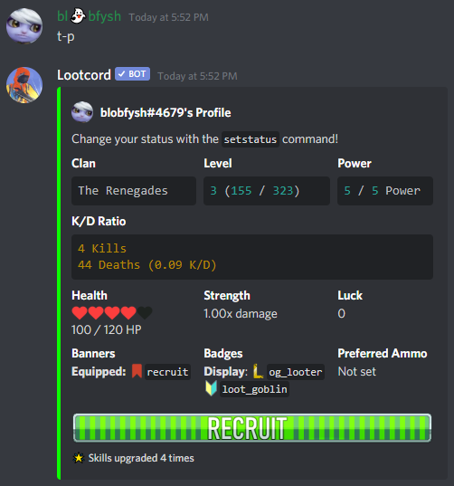

## Opening Boxes

You can open boxes with `t-use <box> <optional amount>` or `t-open <box> <optional amount>`.

You can view all items in your `inventory`:

Your inventory shows how much money and health you have, as well as your currently equipped storage container and all items you own.

[[info]]
| You can also view another player's inventory by specifying: `t-inv blobfysh#4679`. This will only work if they are in the same server.

## Attacking

You can attack other players with `t-use <weapon> <@player>`, you can also attack random players with `t-use <weapon>` random.

If you kill another player, you will receive minimum 2 items, + 1 item for every additional 5 items that player has. You will also receive 50 XP for each item stolen and **75%** of that players money.

More on attacking other players [here](/guides/attacks)

## Healing

You can heal by using a healing item on yourself: `t-use bandage`.

Using a healing item will give you a healing cooldown that will prevent you from using healing items again. This cooldown can vary for each healing item and you can check it with the `item` command:

## Getting More Boxes and Money

You can earn free boxes from the `hourly`, `daily` and `vote` commands. You can also play games such as `trivia` and `scramble`. You can also steal money and boxes from other players by killing them.

If you're a [patron](https://www.patreon.com/bePatron?u=14199989), you can use the `weekly` command for a supply_drop.

## Viewing Your Stats

You can view your K/D ratio and other statistics on your `profile`:

[[info]]
| You can view another player's profile by specifying: `t-profile blobfysh#4679`. This will only work if they are in the same server.