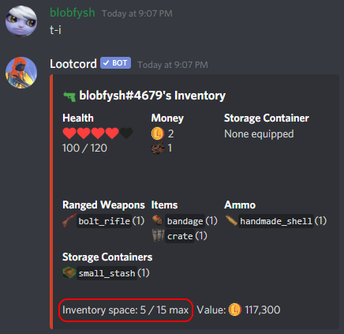
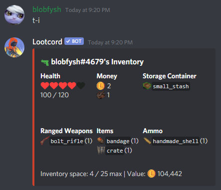

## What Is Inventory Space?

Inventory space determines the maximum number of items you can hold. You can check your inventory space with the `inventory` command:

## How to Gain Inventory Space

You can gain inventory space by equipping a better **storage container**.

After you equip a new storage container, you'll notice your inventory has more space!

### Some Notes About Inventory Space

Banners do **not** count toward inventory space, you can have as many as you want.

It is possible to go over your inventory space limit when voting or killing other players and stealing items. All you have to do to get back under the limit is sell some items in your inventory using the `sell` command.