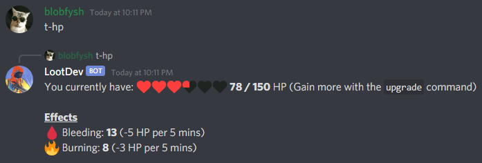

A status effect is an effect that passively alters your player. They come in two forms: buffs and debuffs, though currently all status effects are debuffs. These effects can be applied by using an item such as a [incen\_pistol\_bullet](/item/incen_pistol_bullet) or [hv\_rifle\_bullet](/item/hv_rifle_bullet) to attack another player. Status effects will be reset on death, so if a player that is burning is killed they will no longer be burning.

## Bleeding

Bleeding is a debuff that reduces health at a rate of **5 HP every 5 minutes**. It can be reduced by using a [bandage](/item/bandage) or [large\_medkit](/item/large_medkit).

Bleeding can be stacked and will reduce health to a minimum of 1.

## Burning

Burning is a debuff that reduces health at a rate of **3 HP every 5 minutes**. It reduces health slower than bleeding but cannot be reduced with any healing items.

Burning can be stacked and will reduce health to a minimum of 1.